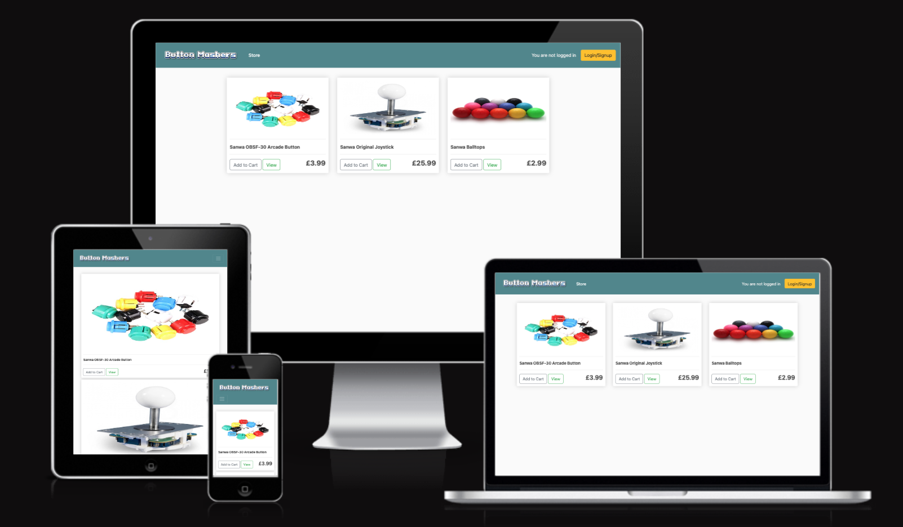

## Introduction

View live site: [Button mashers](https://button-mashers-11120a298309.herokuapp.com/)

Our micro-ecommerce site caters to fighting game enthusiasts who build custom controllers. We sell high-quality arcade controller parts like buttons and joysticks. Our products are designed for reliability and performance, ensuring every punch, kick, and combo is spot-on. We offer a wide variety of colors and styles, allowing for creative and personalized designs.

For full Admin access to Django Admin panel with relevant sign-in credentials: [Button mashers Admin](https://button-mashers-11120a298309.herokuapp.com/admin/login/?next=/admin/)

## Table of Contents

- 
  - [Introduction](#introduction)
  - [Table of Contents](#table-of-contents)
  - [Overview](#overview)
  - [Customer Goals](#customer-goals)
  - [Business Goals](#business-goals)
- [UX/UI - User Experience/User Interface](#uxui---user-experienceuser-interface)
  - [Design Inspiration](#design-inspiration)
    - [Color Scheme](#color-scheme)
    - [Typography \& Iconography](#typography--iconography)
- [Project Planning](#project-planning)
  - [Strategy Plane](#strategy-plane)
    - [Site Goals](#site-goals)
  - [Agile Methodologies](#agile-methodologies)
    - [MoSCoW Prioritization](#moscow-prioritization)
  - [User Stories](#user-stories)
  - [Scope Plane](#scope-plane)
  - [Structural Plane](#structural-plane)
  - [Skeleton \& Surface Planes](#skeleton--surface-planes)
    - [Wireframes](#wireframes)
    - [Database Schema](#database-schema)
    - [Defensive Design](#defensive-design)
- [Features](#features)
  - [CRUD Functionality](#crud-functionality)
  - [Features Showcase](#features-showcase)
  - [Future Features](#future-features)
- [Technologies \& Languages Used](#technologies--languages-used)
  - [Libraries \& Frameworks](#libraries--frameworks)
  - [Tools \& Programs](#tools--programs)
- [Testing](#testing)
- [Deployment](#deployment)
  - [Connecting to GitHub](#connecting-to-github)
  - [Django Project SetUp](#django-project-setup)
    - [Postgres SQL](#postgres-sql)
  - [Heroku Deployment](#heroku-deployment)
    - [Media Folder Setup](#media-folder-setup)
  - [Clone Project](#clone-project)
  - [Fork Project](#fork-project)
- [Credits](#credits)
  - [Code](#code)
  - [Media](#media)
    - [Additional reading/tutorials/books/blogs](#additional-readingtutorialsbooksblogs)
  - [Acknowledgements](#acknowledgements)

## Overview

Buttonmashers is a arcade controller modding/customisation products store focusing on procuring the best components for high level players. Users are invited to:

- View the store as Guests
- Register for an Account
- Review and rate products
- Browse products
- View, add and edit products in their cart
- Checkout and purchase items

## Customer Goals

Buttonmashers offers gamers a seamless and user-friendly shopping experience, focusing on high-quality, durable arcade components and peripherals. We encourage our customers to create accounts, unlocking access to exclusive features of shopping and the ability review/rate products.

Our product range emphasizes longevity and performance, promoting sustainable gaming practices by reducing the need for frequent replacements. We consistently guide our customers towards premium, tournament-grade products that offer the best value in terms of quality and durability.

## Business Goals

Buttonmashers offers the business owners an intuitive Admin Dashboard that simplifies inventory and order management. Users can easily access detailed information about users and orders through the Admin Dashboard, which provides a direct link to the data stored in the Django Admin Panel.

Button Mashers aims to cultivate a loyal community of gaming enthusiasts who appreciate high-quality, durable arcade components and peripherals. The site's focus on premium arcade parts and accessories attracts players looking for authentic, tournament-grade gaming experiences.

# UX/UI - User Experience/User Interface

## Design Inspiration

From the outset of the Button Mashers project, I envisioned a vibrant color palette that reflects the energy of arcade gaming, with bold hues and striking contrasts to create an engaging visual experience. The website maintains a clean and organized layout, utilizing ample white space to draw attention to our products and enhance the overall user experience. This design approach not only highlights our extensive range of arcade components but also captures the dynamic spirit of the gaming community.

created using https://www.textstudio.com/logo 

A pixel art text header was chosen for the Button Mashers website to evoke a sense of nostalgia and excitement that resonates with the gaming community. 

This distinctive style not only captures the essence of classic arcade games but also enhances visual engagement, enhancing key sections of the site.


Product images showcase arcade components against a neutral background on box elements, allowing customers to clearly see details of buttons, joysticks, and other peripherals. The included buttons stand out allowing the user to clearly see options to add the product to their cart or view the product in detail.


The site's header dynamically updates to display the user's login status and the current number of items in their cart, providing visual feedback. Interactive notifications, appear after user actions to confirm operations or offer additional information.

 

### Color Scheme

Initial colour schemes were generated using http://colormind.io/image/


Variables were used within the CSS file to call colours as they were needed:

- Fire-Brick: #9D3A3B;
- Space: #1F212A;
- Teal: #4D848A;
- Off-White: #F4F4F4;
- Gold: #C9A539;

The above colours were chosen to be vibrant and bold but also cohesive enough to work in unison and to aid in a clean simple and accessable design layout.

Compromises were made with Bootstrap components where colours, although similar enough to match the theme, did not exactly match, however design desicions were made based on the functionality of the component to ensure use case was clear.

### Typography & Iconography

In developing my full-stack Django site, I chose to utilize Bootstrap's default fonts to keep the project scope manageable. By leveraging these pre-designed fonts, I was able to maintain a consistent and professional aesthetic without the added complexity of custom typography. This decision not only streamlined the design process but also allowed me to focus on core functionalities and features, ensuring that I could deliver a high-quality user experience efficiently. Using Bootstrap's default fonts provided a solid foundation for my site's visual identity while simplifying development and enhancing overall productivity.

# Project Planning

## Strategy Plane

In developing my project, I adopted an Agile methodology for the strategy plane to ensure flexibility and responsiveness throughout the development process.

The primary goal of the site was to display products to customers, give them the ability to add items to heir cart when logged in/registered and complete a purchase. The functionality to review and rate products was also important to satisfy CRUD criteria on the project.

By breaking down the project into smaller, manageable tasks and prioritizing them based on effort and value, I was able to maintain a focused and iterative development cycle

The site's design and graphic assets were collected through various copyright-free image websites. Images were edited for the website to be cohesive. Bootstrap and Crispy Forms were used for the project's frontend to speed up the process and to keep the templates consistent. Additional customization for buttons, forms, modals, alerts, and user feedback processes has been incorporated into the project's CSS files.. 

### Site Goals

- Site provides enjoyable experience for shoppers.
- Site is clear and accessable.
- Customers feel informed that they are making a good choice of products with Button mashers.
- UX remains similar across screen sizes.
- CRUD functionalities work as intended with easy to use frontend forms.
- Scalable site to allow for extra features in the future (Paypal, build forums etc)

## Agile Methodologies

Button mashers followed Agile planning methodologies to its completion. [GitHub Projects](https://github.com/users/Cloud-Monkey/projects/5/views/1) provided an ideal platform to create issues, boards and milestones for each of the project's Epics. By utilizing labels, I was able to efficiently pinpoint my upcoming tasks and categorize them into the relevant Milestones and Sprints. Concentrating on specific components while developing Button Mashers helped minimize bugs and reduce the likelihood of human errors.

### MoSCoW Prioritization

I chose to follow the MoSCoW Prioritization method for Button mashers, identifying and labeling my:

**Must Haves** These are the essential, non-negotiable elements of the project. Implementing these 'Must Haves' was crucial in achieving the Minimum Viable Product (MVP) status for this initiative.

**Should Haves** While important and beneficial, these features are not critical for the initial MVP phase. 'Must Haves' take precedence over 'Should Haves' in terms of development priority.

**Could Haves** These represent additional enhancements that would augment the project. They're desirable but should only be pursued after addressing more critical components and if resources permit.

**Won't Haves** This category encompasses features that have been deprioritized or deemed unsuitable for the current project scope. These items are either no longer aligned with the project's objectives or are considered low-priority for the present release cycle.

## User Stories

User stories and features were recorded and managed on [GitHub Projects](https://github.com/users/Cloud-Monkey/projects/5/views/1)

## Scope Plane

To focus on the CRUD functionality of the project and learning the new framework of Django, I kept my Button mashers scope lower than some of my previous projects, A fully working e-commerce store was not essential, so I initially planned to keep to the MVP to ensure that I would complete the project successfully.

Features such as a gallery of projects built by customers, an about us page, footer with links, paypal integration were all planned for a future itteration.

Django's MVT framework allowed these features to be built quickly and addition of an Admin frontend panel for managing products and articles created a robust e-commerce site that could start taking orders once paypal is integrated.

Essential features were:
- User Accounts with AllAuth
- Reviews creation and management - Full CRUD
- Product inventory management for Admin - Full CRUD
- Shopping UX with Cart and Checkout processes - Full CRUD
- Site responsivity
    
## Structural Plane

Button mashers is built using Bootstrap and Django incorporating both Python and Javascript with Code Institute's Blog walkthrough as a foundation. I changed structures and styling to fit my own vision and had to add a lot of my own functionality to get cart and checkout features fully working.

A solid green 2px border is used for view buttons on products to replace bootstraps default styling and address contrast issues. Form validation has been left with it's original styling as no change was needed. Bootstrap allowed for easy transition between screen sizes as many ecommerce purchases are made using our mobiles, so this was a priority focus. Bootstrap components such as forms also gave an acceptable finish with minimal or no styling.

## Skeleton & Surface Planes

In the skeleton and surface planes of my project, I focused on creating an intuitive and visually appealing user interface that enhances the overall user experience. The skeleton plane involved carefully structuring the layout and navigation of the website, ensuring that users can easily find and interact with key features such as product listings, shopping cart, and user reviews. 

### Wireframes

[Scene.io](https://www.scene.io/) was used to create initial wireframes for Button mashers. I had a good understanding of what the site would look like and planning followed this initial outline. Although the scope was rolled back to a simple three page design during the iterative process.


### Database Schema


*Database Schema (ERD) for Button mashers displaying relationships between feature components saved within the database*

[Lucidchart](https://www.lucidchart.com/pages/) was used to create the ERD(Entity Relationship Diagram) for Button mashers. To satisfy the assessment criteria, multiple models were created to personalise the Button mashers project. These include:

- **User** User is created on signup, linked to customer and review.
- **Customer** Customer is created on signup and linked to user.
- **Order** Order is connected to customer and order items.
- **Order item** Connected to order and product.
- **Review** Review is connected to order and product.
- **Shipping Address** Shipping address is linked to customer and order.
- **Product** Products may be added by Admin with image and text fields within the Add/Edit products forms.

### Defensive Design

Button Mashers was designed to provide a dependable user experience, aiming to eliminate any frustrations for users and encouraging them to return for future purchases.

- Django AllAuth for user registration/log in/log out
- Input validation and error messages provide feedback to the user to guide them towards the desired outcome. 
- Unregistered users are diverted to the Sign Up page from restricted actions. 
- Authentication processes control edit/delete buttons to reveal them to the Admin only, this is further secured through accessing of CRUD functionalities in the Admin Dashboard. 
- Deletion of data is confirmed through a message, double-checking with the user.
- Testing and validation of features completes the process.

# Features

## CRUD Functionality

Customers have full CRUD functionality with their prospective purchases. They may edit their cart, add more items or remove all items. They may also add their delivery details if they are registered, logged-in users. Button mashers Admin have access to the Admin Dashboard which allow them full CRUD over Product Management and Review posting.

## Features Showcase

**Header & Navigation - All Users**


Nav bar on every page, displays links to store and cart pages, dynamic login status messages and login/logout button.

**Store Page - All Users**


Displays products with option to add to cart for logged in users or view option to expand to detailed view of products.

**Add to cart - Registered Users** **View - All Users**


Adds selected product to cart for registered users.

**Cart - Registered Users**


Shows summary of items added to cart, has add remove items from cart arrow toggles to increase or decrease items in cart

**Checkout - Registered Users**


Shipping address form and items summary, ability to complete purchases and checkout.

**Add/Edit/Delete Reviews - Registered Users**

 

Logged in users can Add a review and ratings for the product, If the review has been added already it can be edited or deleted by the user.

**All Auth - All Users who wish to create an account**

Django AllAuth provides a comprehensive, customisable authentication system that keeps user data safe. If a customer wishes to register an account they may enter their username and email and password x 2 to ensure precision. Upon submitting the form the user will receive a message to inform them of succes and then sign in to Button mashers. 

Consistent with the styling of all form fields across the site, I have customized the design to align with Button Mashers' overall aesthetic. The login page mirrors the registration page, while the logout page offers users two options: to proceed with the logout process or to return to the homepage.

Feedback is continually released to the user through toast messages to confirm successful registration, log in and log out.

When developing this project it was important to me to have a separate Admin area accessible via the frontend, in addition to the Django Backend Panel. I fulfilled this by separating out the CRUD features for the Admin/Superuser into an Admin Dashboard. This provides a direct link to editable forms for adding/editing products and articles. A separated 'Admin' view (viewable only to the Admin when they are logged in) has been created for Articles and Products with lists that display 'Edit' and 'Delete' Buttons. The 'Add' buttons bring the Admin directly to adding products or articles. Crispy Forms and Summernote render forms that allow for a high degree of editing, manipulation and connection to the database models. Defensive design for deletion of items appears in the form of a 'Delete Confirmation' modal.

## Future Features

- **Paypal Integration**
- **Home Page**
- **Gallery of Projects Page**
- **Footer with Forum links**

# Technologies & Languages Used

- HTML
- CSS
- JavaScript
- Python
- [Git](https://git-scm.com/) used for version control.
- [Github](https://www.github.com) used for online storage of codebase and Projects tool.
- [Scene](https://www.scene.io) for project design planning and wireframe creation.
- [Django](https://www.djangoproject.com/) was used as the Python framework for the site.
- [Heroku](https://www.heroku.com) was used to host the 'Button mashers' application.
- [Lighthouse](https://developer.chrome.com/docs/lighthouse) to evaluate the accessibility of the site.

## Libraries & Frameworks

Libraries and frameworks used were dictated by the CI Django blog walkthrough from our course material with the Code Institute. This was supplemented by my own additions that were neccessary to complete the project.

- [Django v4.2.16](https://docs.djangoproject.com/en/4.2/releases/3.2/) 
- [AllAuth v0.41](https://django-allauth.readthedocs.io/) for user authentication and account management.
- [Bootstrap v4.6](https://getbootstrap.com/docs/4.6/getting-started/introduction/) for template rendering.
- [Crispy Forms](https://pypi.org/project/crispy-bootstrap4/) for form rendering.
- [dj-database-url](https://pypi.org/project/dj-database-url/) for DATABASE_URL.
- [django-storages](https://django-storages.readthedocs.io/en/latest/) for handling static and media files.
- [gunicorn](https://docs.djangoproject.com/en/4.2/howto/deployment/wsgi/gunicorn/) apure-Python WSGI server for UNIX.
- [oauthlib](https://pypi.org/project/oauthlib/) OAuth request-signing logic.
- [psycopg2](https://pypi.org/project/psycopg2/) PostgreSQL database adapter for Python.
- [pillow v10.4.0](https://pypi.org/project/pillow/) Allows images upload in admin panel.

## Tools & Programs
- [Towebp](https://towebp.io/) for compressing PNG/WEbp files
- [Lucidchart](https://www.lucidchart.com/pages) for ERD (entity relationship diagram) creation.
- [Favicon](https://favicon.io/) for converting an icon into a favicon.
- [amiresponsive](https://ui.dev/amiresponsive) for screenshot of Button mashers on different screen sizes.
- [Perplexity AI](https://www.perplexity.ai/) for breaking down Python concepts and Django documentation into more understandable chunks.

# Testing


# Deployment

## Connecting to GitHub  

To begin this project from scratch, you must first create a new GitHub repository using the [Code Institute's Template](https://github.com/Code-Institute-Org/ci-full-template). This template provides the relevant tools to get you started. To use this template:

1. Log in to [GitHub](https://github.com/) or create a new account.
2. Navigate to the above CI Full Template.
3. Click '**Use this template**' -> '**Create a new repository**'.
4. Choose a new repository name and click '**Create repository from template**'.
5. In your new repository space, click the gitpod open button to generate a new workspace.

## Django Project SetUp

1. Install Django and supporting libraries:

- ```pip3 install 'django<4' gunicorn```
- ```pip3 install dj_database_url psycopg2``` 
  
1. Once you have installed any relevant dependencies or libraries, such as the ones listed above, it is important to create a **requirements.txt** file and add all installed libraries to it with the ```pip3 freeze --local > requirements.txt``` command in the terminal.  
2. Create a new Django project in the terminal ```django-admin startproject <project name>.```
3. Create a new app eg. ```python3 mangage.py startapp home```
4. Add this to list of **INSTALLED_APPS** in **settings.py** - 'home',
5. Create a superuser for the project to allow Admin access and enter credentials: ```python3 manage.py createsuperuser```
6. Migrate the changes with commands: ```python3 manage.py migrate```
7. An **env.py** file must be created to store all protected data such as the **DATABASE_URL** and **SECRET_KEY**. These may be called upon in your project's **settings.py** file along with your Database configurations. The **env.py** file must be added to your **gitignore** file so that your important, protected information is not pushed to public viewing on GitHub. For adding to **env.py**:

- ```import os```
- ```os.environ["DATABASE_URL"]="<copiedURLpostGres>"```
- ```os.environ["SECRET_KEY"]="my_super^secret@key"```
  
For adding to **settings.py**:

- ```import os```
- ```import dj_database_url```
- ```if os.path.exists("env.py"):```
- ```import env```
- ```SECRET_KEY = os.environ.get('SECRET_KEY')``` (actual extracted to variable within env.py)  

9. Replace **DATABASES** with:

```
DATABASES = {
    'default': dj_database_url.parse(os.environ.get("DATABASE_URL"))
  }
```

10. Set up the templates directory in **settings.py**:

- Under ``BASE_DIR`` enter ``TEMPLATES_DIR = os.path.join(BASE_DIR, ‘templates’)``
- Update ``TEMPLATES = 'DIRS': [TEMPLATES_DIR]`` with:

```
os.path.join(BASE_DIR, 'templates'),
os.path.join(BASE_DIR, 'templates', 'allauth')
```

- Create the media, static and templates directories in the top level of the project file in the IDE workspace.

11. A **Procfile** must be created within the project repo for Heroku deployment with the following placed within it: ```web: gunicorn ecommerce.wsgi```
12. Make the necessary migrations again.

### Postgres SQL

A new database instance was created on [Postgres SQL](https://dbs.ci-dbs.net/) for the project. 

- From your user dashboard, retrieve the important 'postgres://....' value. Place the value within your **DATABASE_URL**  in your **env.py** file and follow the below instructions to place it in your Heroku Config Vars.

## Heroku Deployment

To start the deployment process , please follow the below steps:

1. Log in to [Heroku](https://id.heroku.com/login) or create an account if you are a new user.
2. Once logged in, in the Heroku Dashboard, navigate to the '**New**' button in the top, right corner, and select '**Create New App**'.
3. Enter an app name and choose your region. Click '**Create App**'.
4. In the Deploy tab, click on the '**Settings**', reach the '**Config Vars**' section and click on '**Reveal Config Vars**'. Here you will enter KEY:VALUE pairs for the app to run successfully. The KEY:VALUE pairs that you will need are your:

   - **DATABASE_URL**:**postgres://...**
   - **DISABLE_COLLECTSTATIC** of value '1' (N.B Remove this Config Var before deployment),
   - **SECRET_KEY** and value
   - **CLOUDINARY_API_KEY** and value
   - **CLOUDINARY_API_SECRET** and value
   - **CLOUDINARY_CLOUD_NAME** and value

5. Add the Heroku host name into **ALLOWED_HOSTS** in your projects **settings.py file** -> ```['herokuappname', ‘localhost’, ‘8000 port url’].```
6. Once you are sure that you have set up the required files including your requirements.txt and Procfile, you have ensured that **DEBUG=False**, save your project, add the files, commit for initial deployment and push the data to GitHub.
7. Go to the '**Deploy**' tab and choose GitHub as the Deployment method.
8. Search for the repository name, select the branch that you would like to build from, and connect it via the '**Connect**' button.
9. Choose from '**Automatic**' or '**Manual**' deployment options, I chose the 'Manual' deployment method. Click '**Deploy Branch**'.
10. Once the waiting period for the app to build has finished, click the '**View**' link to bring you to your newly deployed site. If you receive any errors, Heroku will display a reason in the app build log for you to investigate. **DISABLE_COLLECTSTATIC**  may be removed from the Config Vars once you have saved and pushed an image within your project.
    
## Cloudinary Config

[Cloudinary](https://console.cloudinary.com) is used to store the media and static files online for Button mashers. Please follow the below steps to set it up for yourself:

1. Setup Cloudinary Account and Login
2. In the Cloudinary dashboard, copy the CLOUDINARY_URL.
3. Open the env.py file and set the value of the CLOUDINARY_URL constant to the URL you copied from the Cloudinary dashboard
4. Open the codestar/settings.py file and add the apps to INSTALLED_APPS.->

## Clone Project

A local clone of this repository can be made on GitHub. Please follow the below steps:

1. Navigate to GitHub and log in.
2. The [Button mashers repository](https://github.com/Cloud-Monkey/micro-e-commerce-django-paypal) can be found at this location.
3. Above the repository file section, locate the '**Code**' button.
4. Click on this button and choose your clone method from HTTPS, SSH or GitHub CLI, copy the URL to your clipboard by clicking the '**Copy**' button.
5. Open your Git Bash Terminal.
6. Change the current working directory to the location you want the cloned directory to be made.
7. Type `git clone` and paste in the copied URL from step 4.
8. Press '**Enter**' for the local clone to be created.
9. Using the ``pip3 install -r requirements.txt`` command, the dependencies and libraries needed for FreeFido will be installed.
10. Set up your **env.py** file and from the above steps for ElephantSQL, gather the Elephant SQL url for addition to your code and add your SECRET_KEY and STRIPE/AWS keys if using these services.
11. Ensure that your **env.py** file is placed in your **.gitignore** file and follow the remaining steps in the above Django Project Setup section before pushing your code to GitHub.

## Fork Project

A copy of the original repository can be made through GitHub. Please follow the below steps to fork this repository:  

1. Navigate to GitHub and log in.  
2. Once logged in, navigate to this repository using this link [Button mashers Repository](https://github.com/Cloud-Monkey/micro-e-commerce-django-paypal).
3. Above the repository file section and to the top, right of the page is the '**Fork**' button, click on this to make a fork of this repository.
4. You should now have access to a forked copy of this repository in your Github account.
5. Follow the above Django Project Steps if you wish to work on the project.

# Credits

## Code

The following blogs/tutorials complimented my learning for this project:

- Code institue "For the love of Blog" walkthrough (https://learn.codeinstitute.net/courses)
- Django Ecommerce Website Walkthrough (https://www.youtube.com/watch?v=_ELCMngbM0E&list=PL-51WBLyFTg0omnamUjL1TCVov7yDTRng)
- Everneed Ecommerce website by Amy Richardson (https://github.com/amylour/everneed)
- Boutique Ado Code Institute (https://github.com/johnrearden/boutique_ado)
- W3 Schools (https://www.w3schools.com/)
- Perplexity AI (https://www.perplexity.ai/)
- Bootstrap Documentation (https://getbootstrap.com/docs/5.3/getting-started/introduction/)
- Django Documentation (https://www.djangoproject.com/)

## Media

Image credits are as follows:

- Favicon generated using (https://favicon.io/)
- Product Images taken from (https://arcadeshock.com/)

### Additional reading/tutorials/books/blogs

- medium (https://medium.com/)
- Geeks for Geeks (https://www.geeksforgeeks.org/)
- Stackoverflow (https://try.stackoverflow.co/)
- python documentation (https://www.python.org/)
- W3 Schools (https://www.w3schools.com/)
- Perplexity AI (https://www.perplexity.ai/)
- Bootstrap Documentation (https://getbootstrap.com/docs/5.3/getting-started/introduction/)
- Django Documentation (https://www.djangoproject.com/)

## Acknowledgements

- A huge thanks to my wife Katie for her continued support during this project and bootcamp, through all tears for the many cups of coffee, the continued love and support. You are a blessing in my life 

- Much gratitude is extended to my subject matter expert Mark Briscoe, coding coaches John Rearden and Roo MacArthur also my personal facilitator Amy Richardson for their expert guidance and advice during this bootcamp, which gave me the confidence to make the most out of every project.

- Thank you to my fellow students and Code Institute alumni for their guidance, support and good humour.